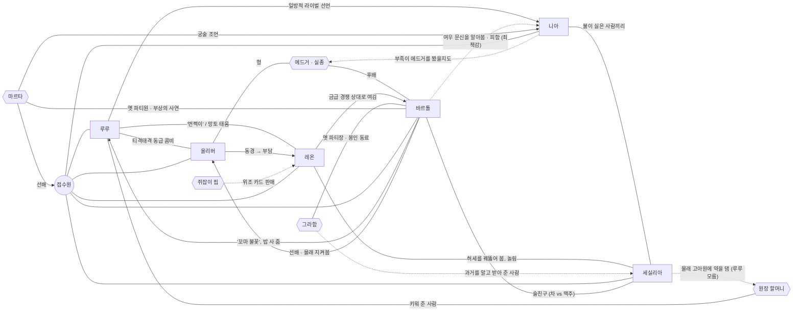

# 네임드 캐릭터 기획서 — 인덱스 & 관계도

> 표기: **[구현됨]** 현재 게임 데이터(`Assets/Data/Characters/`)에 들어가 있음 · **[추가 제안]** 이번 기획서에서 새로 덧붙인 설정 (검토 필요)
> 각 캐릭터 상세: `01_루루.md` ~ `06_바르톨.md`

---

## 1. 명단

| # | 이름 | 칭호 | 나이 | 등급·직업 | 아키타입 | 플레이어에게 남길 감정 |
|---|---|---|---|---|---|---|
| 01 | 루루 | 자칭 대마법사 | 14 | 동 · 마법사 | 허세 꼬마 / 츤데레 | "이 애는 내가 지켜야 해" |
| 02 | 니아 | 숲에서 온 여우 | 19 (겉보기 16) | 동 · 궁수 | 과묵한 수인 / 쿨데레 | "말 한마디가 이렇게 귀할 줄이야" |
| 03 | 올리버 | 오늘 막 등록한 신입 | 16 | 동 · 전사 | 성장형 동기 / 강아지 | "같이 커 가는 친구" |
| 04 | 레온 | 장래의 영웅 | 20 | 은 · 전사 | 허세 귀족 / 성장하는 라이벌 | "밉지 않은 바보, 결국엔 진짜" |
| 05 | 세실리아 | 미소의 수녀 | 27 | 은 · 성직자 | 다정한 누나 / 어두운 과거 | "이 미소 뒤에 뭐가 있지?" |
| 06 | 바르톨 | 은퇴를 앞둔 사자 | 48 | 금 · 전사 | 호쾌한 아저씨 멘토 / 비극 | "제발 은퇴해서 여관 차려 줘" |

NPC (네임드 아님)
| 이름 | 역할 | 한 줄 |
|---|---|---|
| 마르타 (38) | 선배 접수원 | 무뚝뚝한 원칙주의자, 몰래 사탕을 챙겨 줌. 전직 은급 궁수. 20년 전 그라함 파티의 막내(당시 18세) |
| 그라함 (61) | 은퇴한 길드장 | 전설의 전 금급. 바르톨의 옛 파티장. 습격 실패 때 한 번 나서 줌 |
| 에드거 (당시 20) | 올리버의 형 · 실종 | 3년 전 '숲의 왕' 목격 조사 중 실종된 은급 전사 |
| 원장 할머니 | 고아원 원장 | 루루를 키운 사람. 기침이 심해짐 |
| 한나 | 빵집 주인 | 니아의 단골 가게. 2일차 슬라임 의뢰인 |
| 쥐잡이 핍 [추가 제안] | 뒷골목 위조 브로커 | 레온에게 위조 카드를 판 사람. 2주차 '수배서 사건'의 범인 후보 |

---

## 2. 관계도

---

## 3. 호칭표 (행 → 열을 부르는 말)

| ↓가 →를 | 접수원 | 루루 | 니아 | 올리버 | 레온 | 세실리아 | 바르톨 | 마르타 |
|---|---|---|---|---|---|---|---|---|
| **루루** | 접수원 → (호감도 70↑) 이름 | - | 여우 | 신입 | 번쩍이 | 수녀 언니 | 아저씨 | 무서운 언니 |
| **니아** | 접수원 | 루루 | - | 올리버 | 은빛 | 세실리아 | … (부르지 않음) | 마르타 |
| **올리버** | 선배 → 동기 | 루루 | 니아 씨 | - | 레온 님 | 세실리아 누나 | 바르톨 씨 | 마르타 선배 |
| **레온** | 접수원 | 꼬마 마법사 | 여우 아가씨 | 종자(자칭) → 올리버 | - | 수녀님 | 사자 경 | 마르타 양 |
| **세실리아** | 접수원님 | 루루 | 니아 | 올리버 | 레온 도련님 | - | 바르톨 씨 | 마르타 씨 |
| **바르톨** | 꼬마 / 꼬마 접수원 | 꼬마 불꽃 | 여우 아가씨 (눈을 피함) | 녀석 | 금빛 병아리 | 수녀님 | - | 마르타 |

---

## 4. 전체 서사 속 위치 (5주)

| 주차 | 루루 | 니아 | 올리버 | 레온 | 세실리아 | 바르톨 |
|---|---|---|---|---|---|---|
| 1 | 큰 의뢰 욕심, 약값 떡밥 | "쫓겨 내려오는 것들" | 동기 결성 | 위조 카드 사용 | 치료 담당 | 여관의 꿈 |
| 2 | 퇴학 고백 | 부족의 표식 | 형의 검 | 핍과의 연결 · 수배서 사건 | 불 공포 | 그라함과의 과거 |
| 3 | 할머니 병세 악화 | 바르톨과 충돌 | 바르톨 원정 동행 희망 | 편지 · 가문 | 바르톨 원정 치료 동행 | **원정 · 첫 죽음 후보** |
| 4 | 폭발 외 첫 마법 | 에드거의 흔적 발견 | 형의 마지막 의뢰서 | 진짜 이름 | 고해 · 전염병 주간 | (생존 시) 봉인 증언 |
| 5 | 대마법사로서의 한 방 | 숲의 왕 앞으로 | 결과 칸을 채우다 | 영웅으로 선다 | 불을 다시 든다 | (생존 시) 마지막 싸움 |
